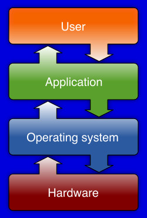
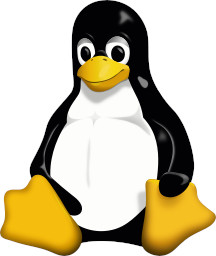

# Session 1

## Operating System



An **Operating System** is a bridge between hardware
and applications.
There are so many operating systems out there which were
made for a specific purpose.
Most famous ones are:
* Windows
* MacOS
* Linux

In this course we will be learning more
about Linux.

## Why Linux

Linux is almost everywhere!
It powers most of the world’s biggest servers,
including those run by tech giants like Google and Meta,
and is by far the best choice for cloud computing.
In embedded systems and IoT, Linux is the go-to for most
developers because of its flexibility.
Even in cutting-edge fields like deep learning,
most research papers and projects are built on Linux platforms.
Also, all the android phones are based on Linux.

For computer engineers, understanding Linux is fundamental.
In this course, we will focus on learning the basics and
exploring the essential concepts that make Linux such a
powerful and useful tool.

To summarize, Linux:
* Widely used
* Open-source
* Free
* Super powerful
* Stable and Reliable
* Secure
* Customizable
* Community support

## History of Linux

### UNIX


Unix is an Operating System designed by
Ken Thompson and Dennis Ritchie in 1969.
It stands for UNiplexed Information Computing System (UNICS).
This Operating System is suitable for multitasking.
It is written in C, making it easier to modify and run
on different hardware. Also, it has a modular design in which
programs are seen as independent entities that can work together
to perform complex tasks.
In Unix, everything is a file, including processes and devices.
This Operating System had a heavy influence on Linux.

### GNU


GNU is a project that aims to make a free UNIX-like
operating system.
It stands for (GNU's Not UNIX).
it was launched by Richard Stallman in 1983.
GNU includes essential components including
GCC(GNU Compiler Collection), GNU Bash, and GNU core utilities
like `ls`, `cp`, `mv`, and `rm`.
While GNU provides so many great components,
it lacks a good kernel which Linux came in and filled the gap.

### Linux



Linux is the kernel of an operating system.
It was developed by Linus Torvalds in 1991.
He was aiming to make a UNIX-like operating system as
a personal project.
Then he combined it with GNU tools to make it a complete
operating system.

## Linux distros

Linux has so many distributions, The most important
of them all are:
* Ubuntu
  * Based on Debian
* Debian
* Fedora
* CentOS
  * Based on Fedora
* Arch linux
* OpenSUSE
* Linux mint
  * Based on Ubuntu, Debian
* Kali Linux
  * Based on Debian
* Elementary OS
  * Ubuntu
* Manjaro
  * Based on Arch Linux
* Pop!_OS
  * Ubuntu
* Slackware

In this class we are focusing on a user-friendly
distro called: **Ubuntu**

## Opening a terminal emulator

In **Ubuntu**, you can simply open a terminal 
using *Alt+Ctrl+T*.

## pwd

`pwd` stands for Print Working Directory.

```bash
pwd
```

The result of this command should show you the
current working directory that you are in.

