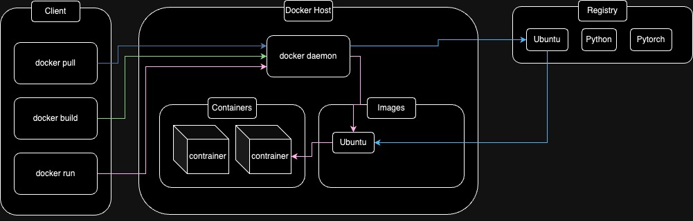

# Session 3: Docker basics

## Introduction

<!--
Docker:
* Open source
* Platform
* Helps:
  * Run
  * Ship
  * Deploy
* Separate application from infrastructure
* Control infrastructure way easier
* Because of methodologies
  * Reduce time between coding and production

* Portable
* lightweight
-->

Docker is an Open source platform.
It helps you to **run**, **ship** and **deploy**
your application.
It separates application from infrastructure to
assist you to deliver your software quicker.
Also, it gives you so many capabilities to control
your infrastructure way easier.
It has a great methodology that reduces the time
between coding and production.
It is lightweight and portable, which makes it super
great to run them anywhere.

## Install Docker

To Install docker we have so many options.
For the purpose of learning the best way to
install docker is via docker desktop.
It contains `Docker Daemon`, `Docker client`
and `Docker Compose` which we are going to work with a lot.
Also, it has a UI to control All the things that we need.

To start with docker desktop you can use this
[link](https://docs.docker.com/get-started/introduction/get-docker-desktop/).

## Run an example

Now that we have everything set up, we can run an example
in our terminal of choice.
Open a terminal and type the code below:

```shell
docker run -i -t ubuntu /bin/bash
```

If you don't have the `Ubuntu` image already,
it would download it then it attaches a `bash` in it.
We are going to learn about the `options` and the `arguments`
of this command more.

Right now, You should see a `bash terminal` opening up
for you which you can run `bash` commands in it.

## Docker Architecture



As you can see in the picture above, the basic
architecture of docker consists of three main components:
* Client
* Docker host
* Registry

We are going to discuss more about them.

## Docker Registry

A docker registry stores DockerImages.
The default Register is [Docker Hub](https://hub.docker.com/).

## Docker Hub

You can access [Docker Hub](https://hub.docker.com/) in your
browser.
For example, we can take a look at [Python image](https://hub.docker.com/_/python).
There are different tags which each one represents different
meaning.

<!-- 
TODO: add more details about each tag
for example: alpine, bullseye, bookworm
-->

## Docker Daemon

## Docker Client

## Image

## Container

## DockerFile

### layers