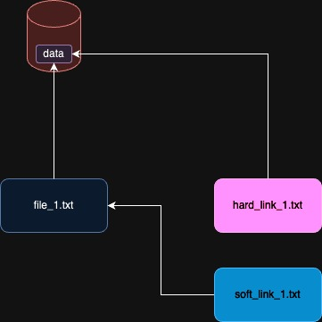

# Session 4

## `chmod`

Is a command to change the permissions of a file or directory.

```shell
chmod [OPTION]... MODE[,MODE]... FILE...
```

In Linux, each file or directory has three types of permisssions:

* read (r)
* write (w)
* execute (x)

And each file or directory has three types of users:

* owner (user) (u)
* group (g)
* others (o)

for example if we have `rwxr-xr--` it means:

* owner can read, write and execute
* group can read and execute
* others can only read

With `chmod` we can change these permissions.
There are two ways to change the permissions:

### Symbolic method

In symbolic method, we can use the following symobls to controll users:

* `u` for user (owner)
* `g` for group
* `o` for others
* `a` for all

Also we can use the following symbols to change permissions:

* `+` to add permission
* `-` to remove permission
* `=` to set permission

And we can use these symbols for the permissions themselves:

* `r` for read
* `w` for write
* `x` for execute

For example:

```shell
chmod u+x file
```

In the example above we have added execute permission to the owner of the file.

Another example:

```shell
chmod g-w file
```

In the example above we have removed write permission from the group of the file.

Another example:

```shell
chmod a=rw file
```

In the example above we have set read and write permissions for all users (owner, group, others).

### Numberic method

In this method we use numbers to change the permissions.

| read | write | execute |
|------|-------|---------|
| 4    | 2     | 1       |

For example:

```shell
chmod 754 file
```

In the example above we have set read, write and execute permissions for the owner of the file,
read and execute permissions for the group
and read permission for others.

* 7 = 4 + 2 + 1 = rwx
* 5 = 4 + 1 = rx
* 4 = 4 = r

## Use chmod instead of `sh` or `bash` for our executable scripts

Now we can use `chmod` to make our scripts executable.
Previously we used `sh` or `bash` to run our scripts.
The only thing that we should do is at first line of our script add the following line:

```shell
#!/bin/bash
```

This line tells the system to use `bash` to run the script.

Then we can use `chmod` to make the script executable for the owner of the file:

```shell
chmod u+x script.sh
```

## `mv`

To move files or rename them, we can use `mv`.
It's like **cuttuing** files.

```shell
mv source_path destination_path
```

For example:

```shell
mv f1.txt ramin/f1.txt
```

* `-f`, `--force`
  * Don't notify before overwriting
* `-i`, `--interactive`
  * Notify before overwriting
* `-v`, `--verbose`
  * Explain what is happening
* `-t`, `--target-directory`
  * Move all sources to target directory
* `-u`
  * If an update is needed, keeps the `old` one
* `-b`
  * Creates **backups** of the existing files
* `-n`, `--no-clobber`
  * Do not overwrite an existing file

## `rm`

Removes files and directories.

```shell
rm source_path
```

For example:

```shell
rm f1.txt
```

* `-r`, `--recursive`
  * Removes directories and their content **recursively**
* `-f`, `--force`
  * Force to remove targets, even if they are write-protected or don't exist
* `-i`, `--interactive`
  * Notify before each removal
* `-d`, `--directory`
  * Remove empty directories
* `-v`, `--verbose`
  * Explain what is happening

## `ln`

makes links between files.

```shell
ln target link_name
```

For example:

```shell
ln f1.txt ramin/f1.txt
```

* `-s`, `--symbolic`
  * Make symbolic (soft) links
* `-f`, `--force`
  * Remove existing destination files
* `-i`, `--interactive`
  * Notify before overwriting
* `-v`, `--verbose`
  * Explain what is happening

different types of links:

* **Hard link**
  * Point to the data to hard drive
* **Symbolic (soft) link**
  * Point to a file



## `ps`

`ps` is a command to show the active processes.

```shell
ps [OPTION]...
```

For example:

```shell
ps
```

The command above shows the active processes of the current user.
By default it has the following columns:

* `PID`
  * Process ID
* `TTY`
  * Terminal
* `TIME`
  * Time
* `CMD`
  * Command

* `-a`
  * Shows all processes (without session leaders)
* `-e`
  * Shows all processes
* `-f`
  * Shows full format
* `-l`
  * Shows long format
* `-x`
  * Shows processes without terminals
* `-u`
  * Shows processes of the specified user

For example to get more information about the processes which are currently running:

```shell
ps -ef
```

## `tty`

`tty` is a command to show the terminal name.

```shell
tty
```

## `kill`

## `fg`

## `bg`

## `awk`

## `top`

## `read`

## `for`

## `array`

## `while`

## `sleep`

## `switch case`
