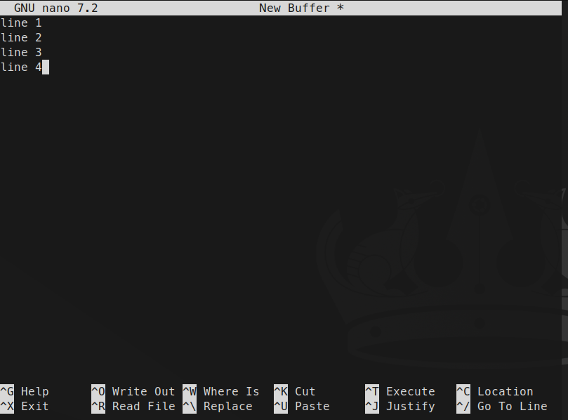
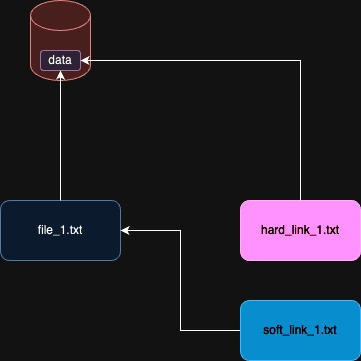

# Session 5: text editors, grep, regex, Linux File System

## `gedit`

`gedit` is a default text editor for `GNOME`.
It is simple and useful.
It has a good `GUI`.

```shell
gedit
```

## `nano`

Nano is a small and simple text editor for use on the terminal.
It copied the interface and key bindings of the Pico editor but
added several missing features:
* undo/redo
* syntax highlighting
* line numbers
* softwrapping
* multiple buffers
* selecting text by holding Shift
* search-and-replace with regular expressions
* and several other conveniences.

It is pretty handy when it comes to:
* quick edits
* configuration file changes,
* working via ssh

```shell
nano file1.txt
```

Here is a look of it:



As you can see options and shortcuts are displayed on the bottom of the terminal.

Useful shortcuts:
* `Ctrl + O`: Save
* `Ctrl + X`: Exit
* `Ctrl + K`: Cuts the entire line
* `Ctrl + U`: Paste at cursor
* `Ctrl + W`: Find 
* `Ctrl + \`: Replace

## `vim`

`Vim` is a powerful and highly configurable text editor that runs in the terminal.
It is based on `Vi`.
It is super effient when you master it.
So many developers love `Vim`.
Most Unix-based operating systems include `Vim` as thier text editor.

### `Vim` modes

`Vim` has different modes:

* Normal mode:
  * For navigation and text manipulation
* Insert mode:
  * For typing text (enter by `i`)
* Visual mode:
  * To select a text (enter by `v`)
* Command mode:
  * To execute commands (enter by `:`)
* Replace mode:
  * To replace existing text by directly writing on it (enter by `R`)

### Open and close

* Open a file: `vim file1.txt`
* Save: `:w`
* Close: `:q`
* Save and close: `:wq`

### Navigation

* `h`: left
* `j`: down
* `k`: up
* `l`: right
* `w`: go to the start of the next word
* `e`: go to the end of the next word
* `b`: go to the start of the previous word
* `gg`: go to the start of the file
* `G`: go to the end-of-art of the file
* `0`: go to the start of the line
* `^`: go to the first non blank character in line
* `$`: go to the end of the line

### editing

* `x`: delete a character under the cursor
* `dw`: delete a word under the cursor

### Insert mode

To enter insert mode there are different options, some of them are:

* `i`: enter insert mode before the cursor
* `a`: enter insert mode after the cursor
* `o`: open a new line and enter insert mode

### Visual mode

To enter visual mode there are different options, some of them are:

* `v`: enter visual mode
* `V`: enter line-wise visual mode
* `ctrl+v`: enter column-wise visual mode


## `ln`

makes links between files.

```shell
ln target link_name
```

For example:

```shell
ln f1.txt ramin/f1.txt
```

different types of links:
* **Hard link**
  * Point to the data to hard drive
* **Symbolic (soft) link**
  * Point to a file 




## `grep`

`grep` stands for **Global Regular Expression Print**.
It searches for the patterns that can be found in the given files.

synopsis:

```shell
grep [options] "pattern" filename
```

example:

```shell
grep "error" file1.txt
```

options:

* `-i`: ignore case sensetive
* `-r`: recusrively read all files in a directory
* `-n`: show line numbers with results
* `-c`: count occurrences
* `-v`: invert match

`grep` is mostly used with `|`. 

for example:

```shell
ls -l | grep file1
```


## regex

## Linux File System

<!--

	•	Hierarchical structure: The Linux file system is organized in a tree-like structure, with the root directory / at the top.
	•	Root directory (/): The base of the file system, all directories and files stem from this point.
	•	Common directories:
	    •	/bin: Essential binaries (executables) for system operation.
	    •	/boot: Files required to boot the system.
	    •	/dev: Device files (e.g., disks, peripherals).
	    •	/etc: Configuration files for system-wide settings.
	    •	/home: User directories, each user has their own subdirectory (e.g., /home/username).
	    •	/lib: Shared libraries needed by the binaries in /bin and /sbin.
	    •	/media or /mnt: Mount points for external file systems (e.g., USB drives, network storage).
	    •	/opt: Optional add-on software.
	    •	/proc: Virtual file system providing process and system information.
	    •	/root: Home directory for the root (superuser).
	    •	/sbin: System binaries for administrative tasks.
	    •	/tmp: Temporary files (often cleared at reboot).
	    •	/usr: Contains user utilities and applications.
	    •	/var: Variable files like logs, caches, and spool files.
	•	File types:
	    •	Regular files: Normal data files.
	    •	Directories: Containers for other files.
	    •	Device files: Represent hardware devices (block or character devices).
	    •	Links: Can be symbolic (soft) or hard, used to reference other files.
	    •	Sockets and pipes: For inter-process communication.
	•	Permissions:
	    •	Three types: read (r), write (w), and execute (x).
	    •	Assigned to three groups: owner, group, and others.
	•	Mounting: File systems (e.g., external drives, partitions) must be mounted to a directory before use.
	•	Inodes: Each file has an inode that stores metadata like file size, permissions, and ownership, but not the filename.
	•	File systems types:
	    •	ext4: Most common default file system in Linux.
	    •	xfs, btrfs, zfs: Other advanced file systems with specific features.
	•	Everything is a file: In Linux, almost everything is treated as a file, including hardware devices, processes, and sockets.

-->

### Hierarchical structure

Linux File System is like a tree.
Add the root of this tree called
`root` directory which is represented by `/`.
All the directories and files are stem from
`root` directory.
To give an **absolute** address of a file we can simply
start with root, for example, `/home/ramin/example.txt`

:::{note}
Install `tree` and find the most practical arguments.
Also explain the output of it.
:::

```text
.
|-- bin -> usr/bin
|-- boot
|-- dev
|   |-- console
|   |-- core -> /proc/kcore
|   |-- fd -> /proc/self/fd
|   |-- full
|   |-- mqueue
|   |-- null
|   |-- ptmx -> pts/ptmx
|   |-- pts
|   |-- random
|   |-- shm
|   |-- stderr -> /proc/self/fd/2
|   |-- stdin -> /proc/self/fd/0
|   |-- stdout -> /proc/self/fd/1
|   |-- tty
|   |-- urandom
|   `-- zero
|-- etc
|   |-- alternatives
|   |-- apt
|   |-- bash.bashrc
|   |-- bindresvport.blacklist
|   |-- cloud
|   |-- cron.d
|   |-- cron.daily
|   |-- debconf.conf
|   |-- debian_version
|   |-- default
|   |-- dpkg
|   |-- e2scrub.conf
|   |-- environment
|   |-- fstab
|   |-- gai.conf
|   |-- gnutls
|   |-- group
|   |-- group-
|   |-- gshadow
|   |-- gshadow-
|   |-- host.conf
|   |-- hostname
|   |-- hosts
|   |-- init.d
|   |-- issue
|   |-- issue.net
|   |-- kernel
|   |-- ld.so.cache
|   |-- ld.so.conf
|   |-- ld.so.conf.d
|   |-- legal
|   |-- libaudit.conf
|   |-- login.defs
|   |-- logrotate.d
|   |-- lsb-release
|   |-- machine-id
|   |-- mke2fs.conf
|   |-- mtab -> /proc/mounts
|   |-- networks
|   |-- nsswitch.conf
|   |-- opt
|   |-- os-release -> ../usr/lib/os-release
|   |-- pam.conf
|   |-- pam.d
|   |-- passwd
|   |-- passwd-
|   |-- profile
|   |-- profile.d
|   |-- rc0.d
|   |-- rc1.d
|   |-- rc2.d
|   |-- rc3.d
|   |-- rc4.d
|   |-- rc5.d
|   |-- rc6.d
|   |-- rcS.d
|   |-- resolv.conf
|   |-- rmt -> /usr/sbin/rmt
|   |-- security
|   |-- selinux
|   |-- shadow
|   |-- shadow-
|   |-- shells
|   |-- skel
|   |-- subgid
|   |-- subgid-
|   |-- subuid
|   |-- subuid-
|   |-- sysctl.conf
|   |-- sysctl.d
|   |-- systemd
|   |-- terminfo
|   |-- update-motd.d
|   `-- xattr.conf
|-- home
|   `-- ubuntu
|-- lib -> usr/lib
|-- media
|-- mnt
|-- opt
|-- proc
|   |-- 1
|   |-- 303
|   |-- buddyinfo
|   |-- bus
|   |-- cgroups
|   |-- cmdline
|   |-- config.gz
|   |-- consoles
|   |-- cpuinfo
|   |-- crypto
|   |-- device-tree -> /sys/firmware/devicetree/base
|   |-- devices
|   |-- diskstats
|   |-- docker
|   |-- driver
|   |-- execdomains
|   |-- filesystems
|   |-- fs
|   |-- interrupts
|   |-- iomem
|   |-- ioports
|   |-- irq
|   |-- kallsyms
|   |-- kcore
|   |-- key-users
|   |-- keys
|   |-- kmsg
|   |-- kpagecgroup
|   |-- kpagecount
|   |-- kpageflags
|   |-- loadavg
|   |-- locks
|   |-- meminfo
|   |-- misc
|   |-- modules
|   |-- mounts -> self/mounts
|   |-- net -> self/net
|   |-- pagetypeinfo
|   |-- partitions
|   |-- pressure
|   |-- self -> 303
|   |-- slabinfo
|   |-- softirqs
|   |-- stat
|   |-- swaps
|   |-- sys
|   |-- sysrq-trigger
|   |-- sysvipc
|   |-- thread-self -> 303/task/303
|   |-- timer_list
|   |-- tty
|   |-- uptime
|   |-- version
|   |-- vmallocinfo
|   |-- vmstat
|   `-- zoneinfo
|-- root
|-- run
|   |-- lock
|   `-- systemd
|-- sbin -> usr/sbin
|-- srv
|-- sys
|   |-- block
|   |-- bus
|   |-- class
|   |-- dev
|   |-- devices
|   |-- firmware
|   |-- fs
|   |-- kernel
|   `-- module
|-- tmp
|-- usr
|   |-- bin
|   |-- games
|   |-- include
|   |-- lib
|   |-- libexec
|   |-- local
|   |-- sbin
|   |-- share
|   `-- src
`-- var
    |-- backups
    |-- cache
    |-- lib
    |-- local
    |-- lock -> /run/lock
    |-- log
    |-- mail
    |-- opt
    |-- run -> /run
    |-- spool
    `-- tmp
```

### Common directories

#### `/bin`

Contains essential binaries (executables) for system operations.
For example, if we `ls`, `/bin` directory, we can see that
`pwd`, `ls`, `cp`, etc. are in it.

#### `/boot`

Contains the files that is needed to `boot` our system.
For example `GRUB` stores the files required for booting
in `/boot`.

<!-- TODO: fact check -->

#### `/dev`

`/dev` contains the device files.
These files can be **Character files**, **Block files** or **links**.


<!-- TODO: Complete it even more -->